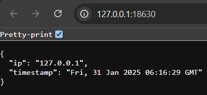

**Dockerized App on Azure: Infrastructure Automation with Terraform**
===============================================

This repository contains the solution to the **Particle41 DevOps Team Challenge**, which provides a simple web service (`SimpleTimeService`) along with the necessary infrastructure to deploy it in a Azure cloud environment. It covers application development, containerization, and automated deployment using Terraform.

Table of Contents
-----------------

-   [Task 1 - SimpleTimeService Deployment App](#Task-1---SimpleTimeService-Deployment-App-Guide)
-   [Task 2 - Terraform and Cloud Deployment](#Task-2---AKS-Deployment-with-Load-Balancer-Guide)  
  
**Task 1 - SimpleTimeService Deployment App Guide**
======================================

This Section provides step-by-step instructions to **clone**, **build**, **push**, and **run** the SimpleTimeService Docker container. It also includes the GitHub Actions workflow for automated Docker builds and publish.
* * * * *

 Prerequisites
--------------------

Before proceeding, ensure you have the following tools installed:

Mandatory - <br> 
**Git** - [Installation link](http://git-scm.com/downloads)<br>
**Docker** - [Installation link linux](https://docs.docker.com/engine/install/)  , [Installation link windows](https://docs.docker.com/desktop/setup/install/windows-install/)<br>
Optional - [GitHub Account](https://github.com/signup), [Docker Hub Account](https://app.docker.com/signup) (for automation)


* * * * *

**Cloning the Repository**
-----------------------------

Clone the project from GitHub Repository in your working directory:

```
git clone https://github.com/NaveenKumar-Y/Dockerized-App-Azure-Infrastructure.git
cd Dockerized-App-Azure-Infrastructure/app
```

* * * * *

**Building & Running Locally (Manual Method)**
--------------------------------------------------

### **Step 1: Build or pull the Docker Image**


```
docker build -t naveenykumar/simpletimeservice:latest .
```
or <br>
```
docker pull naveenykumar/simpletimeservice:latest
```

### **Step 2: Run the Container**

```
docker run naveenykumar/simpletimeservice:latest
```

-  Click on the service endpoints in the output of Docker run command or  service will be available at **`http://<your-ip>:18630`** or **`http://localhost:18630`**. 
<br>
<br>
*Preview:*

   

* * * * *

**Automating with GitHub Actions**(Optional)
-------------------------------------

### **Step 1: Configure Docker Hub Credentials**

1.  Create and go to your GitHub repository.
2.  Navigate to **Settings** → **Secrets and variables** → **Actions**.
3.  Click **New repository secret** and add:
    -   **`DOCKER_USERNAME`** → Your Docker Hub username
    -   **`DOCKER_PASSWORD`** → Your Docker Hub password or access token

### **Step 2: Add GitHub Actions Workflow**

 [.github/workflows/build_publish_docker.yml](.github/workflows/build_publish_docker.yml)  - use this exisiting file in the repository to trigger the Build process (make sure have some change in app/ folder):


```
name: Build and Push Docker Image

on:
  push:
    branches:
      - main
    paths:
      - 'app/**'

jobs:
  build-and-push:
    runs-on: ubuntu-latest  
    steps:
      - name: Checkout Repository
        uses: actions/checkout@v4

      - name: Log in to Docker Hub
        uses: docker/login-action@v3
        with:
          username: ${{ secrets.DOCKER_USERNAME }}
          password: ${{ secrets.DOCKER_PASSWORD }}

      - name: Build Docker Image
        working-directory: app/
        run: docker build -t naveenykumar/simpletimeservice:latest .

      - name: Push Docker Image
        run: docker push naveenykumar/simpletimeservice:latest

```
NOTE : Make sure to have on_push 

### **Step 3: Push Code to Trigger the Workflow**

Once this file is committed and pushed to the branch main in GitHub, GitHub Actions will:

1.  Build the Docker image.
2.  Push it to Docker Hub automatically.

Sample GitHub Action Run : [Link to Build Job run](https://github.com/NaveenKumar-Y/particle41_assessment/actions/runs/13066787923/job/36460429960)

* * * * *

**Pulling & Running the Container Anywhere**
-----------------------------------------------

After the image is published, anyone can deploy the container without building it manually.


```
docker pull naveenykumar/simpletimeservice:latest
docker naveenykumar/simpletimeservice
```

Now, the service will be running and accessible at:\
👉 **`http://<server-ip>:18630`**

* * * * *
<br>
<br>
<br>

**Task 2 - AKS Deployment with Load Balancer Guide**
=================================

Overview
--------

This project sets up an **Azure Kubernetes Service (AKS) cluster** in Azure Cloud with **2 public and 2 private subnets**, deploys a containerized application to the private subnets, and exposes it through a **Load Balancer (LB) in the public subnets**.

Prerequisites
-------------

Before running the Terraform deployment, ensure you have the following installed:

-   **Azure Cloud Account**: [Getting Started](https://azure.microsoft.com/en-in/pricing/purchase-options/azure-account/)

-   **Terraform**: [Install Guide](https://developer.hashicorp.com/terraform/install) - version v1.10.5

-   **Azure CLI**: [Install Guide](https://learn.microsoft.com/en-us/cli/azure/install-azure-cli) or use Azure Cloud Shell in Azure Cloud UI.

-   **Kubectl** (for interacting with the AKS cluster): [Install Guide](https://kubernetes.io/docs/tasks/tools/install-kubectl/) or use Azure Cloud Shell in Azure Cloud UI.
- Optional - [GitHub Account](https://github.com/signup), [Terraform Cloud Account](https://app.terraform.io/public/signup/account) - for automation


Authentication
--------------

Before running Terraform, authenticate to Azure using:

```
az login
az account set --subscription <your-subscription-id>
```
Create a subscription if not created already and fetch the **\<your-subscription-id\>** from the subscription UI. <br>

If you haven't already created a **Service Principal (SPN)** for Terraform, create one using:

```
az ad sp create-for-rbac --name "Terraform-actions-SPN" --role="Contributor" --scopes="/subscriptions/<your-subscription-id>"
```
Copy the output of the SPN creation and use it for authentication(**store the credentials securely**), we have to use this credentials in deployment steps.


Deployment Steps (Local Machine)
----------------

### 1. Clone the Repository

```
git clone https://github.com/NaveenKumar-Y/Dockerized-App-Azure-Infrastructure.git
cd Dockerized-App-Azure-Infrastructure
/terraform
```

### 2. Set Up Variables and credentials

Use default values or customize the [`terraform.tfvars`](/terraform/terraform.tfvars) file with your values:

```
location            = "East US"
resource_group_name = "naveen-resource-group"
vnet_name           = "naveen-vnet"
...
```
Replace the credentials values in [`main.tf`](./terraform/main.tf) under the `azurerm` provider block with the respective values of credentials:

```
provider "azurerm" {
  subscription_id = <subscription_id>
  tenant_id       = <tenant_id>
  client_id       = <client_id>
  client_secret   = <client_secret>
  features {}
}
```

###  3. Initialize Terraform

```
terraform init
```

### 4. Validate Configuration

```
terraform plan
```

This step ensures everything is configured correctly.

### 5. Apply Infrastructure Deployment

```
terraform apply -auto-approve
```

This command provisions:

-   **Azure VPC** with 2 public and 2 private subnets

-   **AKS Cluster** with nodes in private subnets

-   **Load Balancer** in public subnets to expose the service

-   **Deployment of the containerized application** <br>
  
The State of this deployment will be saved locally in .terraform directory.

### 6. Retrieve Load Balancer IP

Once the deployment is successful, retrieve the public LB IP or from the AKS cluster UI "**Services and ingresses**" tab:

```
kubectl get svc -n default
```

Look for the `**EXTERNAL-IP**` of the LoadBalancer service.

### 7. Test the Application

Open your browser or use `curl` to access the service:

```
curl http://<load-balancer-ip>:18630
```

You should see a JSON response with a timestamp and IP address.

Cleanup
-------

To destroy all resources, run:

```
terraform destroy -auto-approve
```

Troubleshooting
---------------

-   If Terraform Command fails check if Environment Variable is set for $PATH in your system - [guide](https://jeffbrown.tech/install-terraform-windows/)

-   If `kubectl` commands fail, fetch credentials using:

    ```
    az aks get-credentials --resource-group naveen-resource-group --name naveen-aks-cluster
    ```


Automation via GitHub Actions & Terraform Cloud (TFC) (Optional)
----------------------------------------------------------------

### **Step 1: Configure Terraform Cloud**

1.  Create and go to your Terraform Account.
2.  Create project, workspace and Token.
3.  In GitHub repository, navigate to **Settings** → **Secrets and variables** → **Actions**.
4.  Click **New repository secret** and add:
    -   **`TFC_TOKEN`** → TFC access token
### **Step 2: Configure Workspace**
- Store Azure credentials (client_id, client_secret, subscription_id, tenant_id) as **TFC Secret Variables** 
- Uncomment [`provider-variables.tf`](/terraform/provider-variables.tf) file.
- Uncomment and update the [`backend.tf`](./terraform/backend.tf) file with your **workspace name**.


### **Step 3: Push Code to Trigger the Workflow**
- [build_terraform_azure_resources.yml](build_terraform_azure_resources.yml)  - use this exisiting file in the repository to trigger the Build process (make sure have some change in terraform/ folder):
- Once the files are committed and pushed to the branch main in GitHub, GitHub Actions will run **terraform plan** and **terraform apply**.
- From this setup we don't have to hard code sensitive values in our code, and secure our state file, and automate our Deployment.
  

Sample GitHub Action Run : [Link to Build Job run](https://github.com/NaveenKumar-Y/particle41_assessment/actions/runs/13088189096)

Now, the service will be running and accessible at:\
👉 **`http://<EXTERNAL-IP>:18630`**

* * * * *